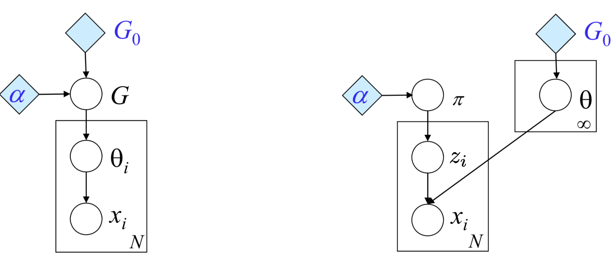
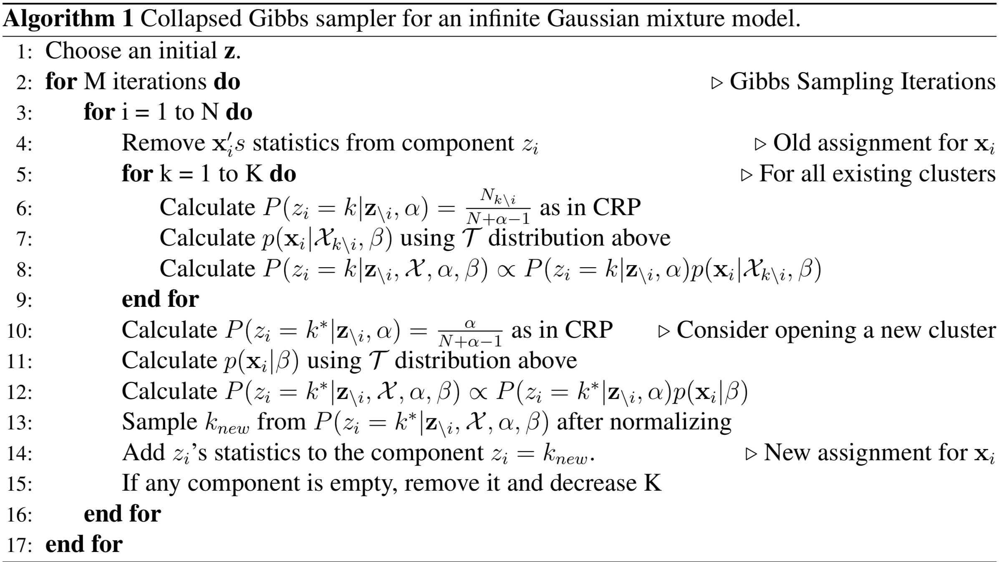
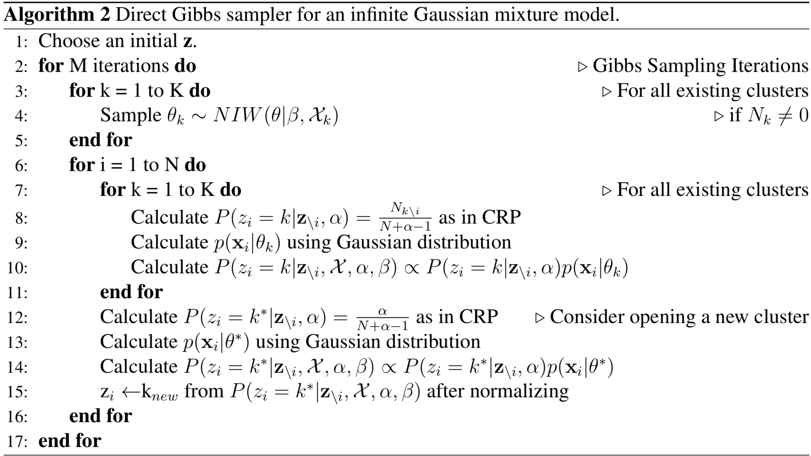
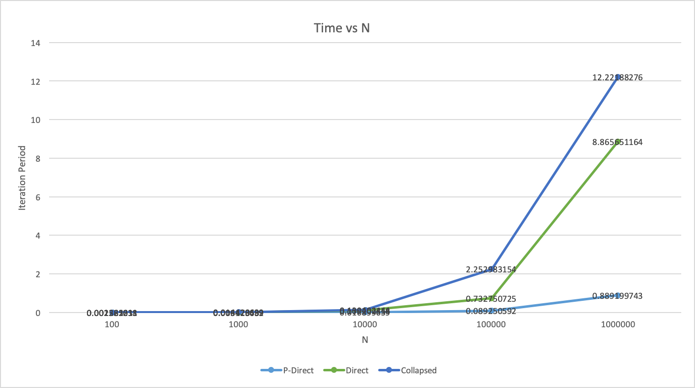
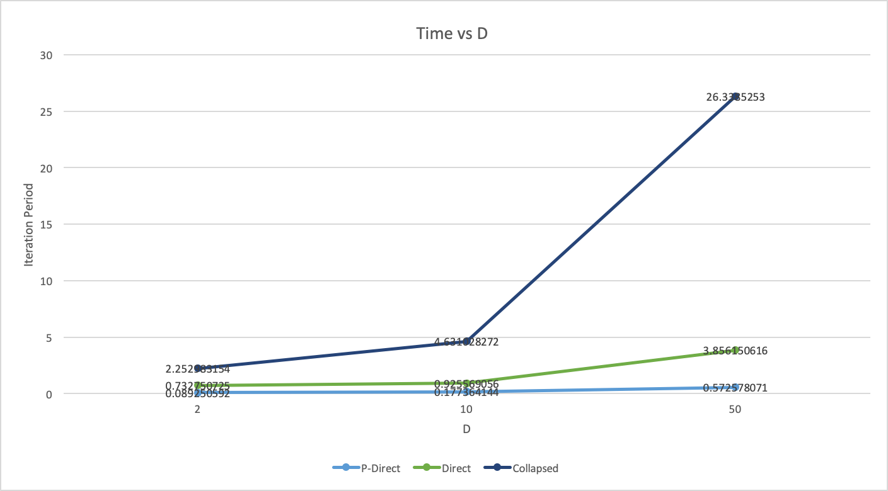
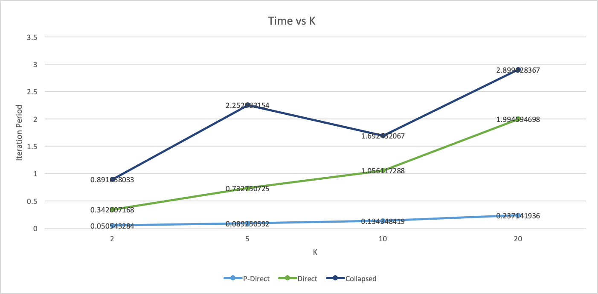
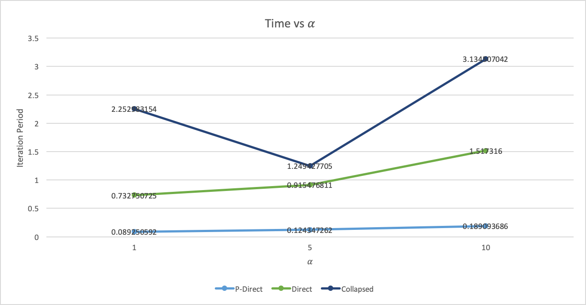

# DPMM.jl

This repository is a research work on parallel dirichlet process mixture models and clustering on Julia by Ekin Akyürek with supervision of John W. Fischer III. 

## Bacground

### 1. Mixture Models

Mixture models are statistical models for representing a data comes from different probability distributions. A mixture model generally parametrized by mixture(i.e component) parameters and mixture weights which can be considered as prior probability of mixtures in the Bayesian setting. The more weight attached to a mixture, the more data comes from that mixture. In this work, we will mostly use the notation for mixture models which are presented in the document[^Kamper, 2013]:

#### Data 

$$
\begin{array}{|l|l|}
\hline
N & \text{Number of data vectors} \\
D & \text{Dimension of data vectors} \\
x_i ∈ RD & \text{The $i^th$ data vector} \\
X = (x_1, x_2,...,x_N) & \text{Set of data vectors} \\
X_{\setminus i} & \text{Set of data vectors, without taking $x_i$ into account}\\
X_k  & \text{Set of data vectors from mixture component k} \\ 
X_{k \setminus i}  & \text{Set of data vectors from mixture component k, without taking $x_i$ into account}  \\
N_k & \text{Number of data vectors from mixture component k} \\  
N_{k \setminus i} & \text{Number of data vectors from mixture component k, without taking $x_i$ into} \newline & \text{account} \\ \hline
\end{array}
$$

#### Model

$$
\begin{array}{|l|l|} \hline
K & \text{Number of components in a finite mixture model} \\
z_i & \text{Discrete latent state indicating which component observation xi belongs to} \\
\mathbf{z} = (z_1, z_2,...,z_N) & \text{Latent states for all observations $x_i$,..., $x_n$} \\
\mathbf{z}_{\setminus i} & \text{Set of all latent states excluding zi}\\
\theta_k  & \text{Component parameters (e.g. $\mu_k$, $\Sigma_k$ in a gaussian mixture model)}  \\
\pi_k & \text{Prior probability that data vector $x_i$ will be assigned to mixture component k} \\
\mathbf{\pi} = (\pi_1,\pi_2,...,\pi_K) & \text{Prior assignment probability for all K components} \\
\beta & \text{Hyperparameters of the prior distribution for $\theta$ parameters in a bayesian setting} \\ \hline
\end{array}
$$

### 2. Dirichlet Process Mixture Models (DPMM)

#### 2.1 Dirichlet Processes (DP)

There are many ways to interpret DP. Formally, it is random process whose realizations are probability distributions. The constructive definition of dirichlet process is done by stick-breaking processes.  Chineese Restraunt Process(CRP) and Pólya Urn Scheme also leads to DP. All these definitions are related with each other thanks to [de Finetti's exchangibility theorem](https://en.wikipedia.org/wiki/De_Finetti%27s_theorem). 

DP is parametrized by $\alpha​$ concentration parameter and $G_0​$ base distribution. One can show that $\alpha​$ controls how similar draws to the $G_0​$. Therefore, G is used to denote samples drawn from DP.

##### 2.1.1 Stick-Breaking Construction

Stick-breaking provides a nice way to draw samples from, but it requires to countably infinite summation. As we stated earlier, draws from DP is itself a distribution which is indeed discrete. Stick-Breaking steps are deliniated in the below.
$$
\begin{equation}
v_1,v_2,...,v_i,... \sim Beta(1,\alpha)\\
\pi_i = v_i \prod_{j=1}^{i-1}(1-v_j) \\ 
\theta_1,\theta_2,...,\theta_i,... \sim G_0 \\
G = \sum_{i=1}^{\infin}\pi_i\delta_{\theta_i}
\end{equation}
$$
Here $\delta_{\theta_i}​$ is a indicator function centered on $\theta_i​$, namely $\delta_{\theta_i}(\theta)​$ is zero everywhere except $\theta=\theta_i​$.  Realize that $\pi_i​$'s approaches to zero as i goes to infinity, so it enables to approximate G using a finite summation instead of infinite one.

##### 2.1.2 Chineese Restraunt Process (CRP)

Chineese restraunt process is a dicrete process which is named after the analogy of seating customers to at tables in a restraunt. Let say customers $1:N$, we will seatch each customer sequentially with the following probabilities where $c_k$ is the number of customers seated $k^{th}$ table and, $i​$ is current number of customers seated in the restraunts.
$$
z_i|z_1,...,z_{i-1} = \begin{cases}
P(z_i=k)=\frac{c_k}{i-1+\alpha} & \text{for an existing table} \\
P(z_i=K+1)=\frac{\alpha}{i-1+\alpha} & \text{for opening a new table}
\end{cases}
$$
Note that this proceess is independent of the order of customers. This means that the CRP is exchangable[^Fang, 2016].

If we assuma a base measure $G_0​$ as a prior for table/cluster parameters and assign each table a probability measure sampled from $G_0​$, the process becomes CRP Mixture Model or Pólya Urn Scheme.
$$
\begin{aligned}
\theta_1...,\theta_K,... &\sim G_0 \\
z_i|z_1,...,z_{i-1} &= \begin{cases}
P(z_i=k)=\frac{c_k}{i-1+\alpha} & \text{for an existing table/cluster} \\
P(z_i=K+1)=\frac{\alpha}{i-1+\alpha} & \text{for opening a new table/cluster}
\end{cases}\\
X_i|z_i &\sim f(X_i|\theta_{z_i})
\end{aligned}
$$
Exchangibility allows us to show that above model equals to[^Blackwell, MacQueen, 1973][^Blei,2007]:
$$
\begin{aligned}
G &\sim DP(\alpha,G_0) &&\\
\theta_i|G &\sim G && i \in 1,...,N \\
X_i|\theta_i &\sim  f(X_i|\theta_i) && i \in 1,...,N \\
\end{aligned}
$$

##### 2.1.3 Formal Definition

We stated that samples from dirichlet process were probability distribution itself. Let say a sample is a probability distribution over S space. Let $\{A_i\}_{i=1}^n​$ denote a measurable partition of S. For any measureble partition of S below statement holds ($Dir​$ is Dirichlet Distribution):
$$
\begin{aligned}
G \sim DP(\alpha,G_0) \implies  (G(A_1),G(A_2),...,G(A_N)) \sim Dir(\alpha G_0(A_1),...,\alpha G_0(A_N))
\end{aligned}
$$
This defines Dirichlet Process, however doesn't allow to draw samples from unlike CRP or Pólya Urn.

#### 2.2 Infinite Mixture Models

As we show in CRP section, Diricihlet process is very good prior on cluster parameters because we can model infinite number of clusters. Note that every finite data realization of DPMM is a finite mixture model with Dirichlet distribution as shown in formal definition. One can use finite stick-breaking process to construct DP, however it has approximation errors. On the other hand, CRP Mixture Model provides exact way to sampling or do inference on the mixture data. Finally,  these two different representations are summarized by below graphical model representations. In the following section we will discuss how to do inference on DPMM.

​			 `


## 3. Inference in DPMM

Inference problem that we interested is to obtain cluster assignments for each data point given base distribution $G_0$ and $\alpha​$ parameter. We will use conjuagte prior which assure that posterior probability of cluster parameters are in same distribution family with the prior. Let's investigate conjugate priors for Gaussian and Multinomial distributions.

### 3.1 Gaussian Conjugate: Normal-Inverse-Wishart Distribution

Multivariate Gaussian Distribution generally parametrized by mean vector $\mu​$ and covariance matrix $\Sigma​$. Normal-Inverse-Wishart(NIW) Distribution[^NormalInverseWishart, Wikipedia] is the prior distrubution for Gaussian with unkown $\mu​$ and and unknown $\Sigma​$.

Normal-Inverse-Wishart is parametrized by:
$$
\begin{array}{|l|l|}
\hline
 \boldsymbol \mu_0  & \text{prior mean for $\mu$} \\ 
 \boldsymbol \Psi_0 & \text{proportional to prior mean $\Sigma$}\\
 \lambda_0 & \text{how strongly we believe the  $\mu_0$}\\
 \nu_0 & \text{how strongly we believe the  $\Psi_0$}\\ 
 \hline
\end{array}
$$
NIW has seperable pdf function with Gaussian and Inverse-Wishart($\mathcal{W}^{-1}​$)

$$p(\boldsymbol\mu,\boldsymbol\Sigma|\boldsymbol\mu_0,\lambda_0,\boldsymbol\Psi_0,\nu_0) = \mathcal{N}\left(\boldsymbol\mu\Big|\boldsymbol\mu_0,\frac{1}{\lambda}\boldsymbol\Sigma\right) \mathcal{W}^{-1}(\boldsymbol\Sigma|\boldsymbol\Psi_0,\nu_0)​$$

The  $\mathcal{W}^{-1}​$ includes `inverse` because the inverse of the sampled matrices has Wishart($\mathcal{W}​$) distrubition. To understand further and to learn how to sample from Wishart distribution see the reference for the Bartlett decomposition method [^Inverse-Wishart, Wikipedia].

If we use sample mean($\hat{\mu}$) and sample covariance($\hat{\Sigma}$) matrix as sufficent statistics, posterior parameters for the Normal-Inverse-Wishart distribution is given by the below equations:[^Kamper,2013]
$$
\begin{aligned}
p(\boldsymbol\mu,\boldsymbol\Sigma|\mathcal{X}) & = NIW(\boldsymbol\mu,\boldsymbol\Sigma| \boldsymbol  \mu_N,  \boldsymbol  \Psi_N, \lambda_N, \nu_N)  \\
\boldsymbol \mu_N & = \lambda_0 \boldsymbol \mu_0 + N \hat{\mu} \\
\lambda_N & = \lambda_0 + N \\
\nu_N & = \nu_0 + N \\
\boldsymbol \Psi_N &=  \Psi_0 + \hat{\Sigma} + \frac{\lambda_0N}{\lambda_0+N}(\hat{\mu}-\boldsymbol \mu_0)(\hat{\mu}-\boldsymbol \mu_0)^T
\end{aligned}
$$
It is also possible to store $t =N\hat{x}​$ and $T=\sum_{i=1}^Nxx^T​$ as sufficient statistics, which is computationally adventagous, the equations become:  
$$
\begin{aligned}
\boldsymbol \mu_N & = \lambda_0 \boldsymbol \mu_0 + t \\
\lambda_N & = \lambda_0 + N \\
\nu_N & = \nu_0 + N \\
\boldsymbol \Psi_N &=  \Psi_0 + T + \lambda_0\boldsymbol\mu_0\boldsymbol\mu_0^T-\lambda_N\boldsymbol\mu_N\boldsymbol\mu_N ^T
\end{aligned}
$$

#### Low-Rank Updates for $\Psi_N$

In the program we store $\Psi_N$ cholesky factorized form to sample efficently. However,  we need to calculate cholesk factorization,which is $\mathcal{O(n^3)}​$, everytime if we remove or add single data point. For that case, there is a faster algorithm to compute updated cholesky factorization from the previous cholesky factorization[^Seeger, 2008]. We utilize rank-1 update and rank-1 downdate methods to speed up the collapsed gibbs sampler.

### 3.2 Multinomial Conjugate: Dirichlet Distribution

In discrete data setting, multinomial probabilty distribution is used for likelihood of data. Dirichlet distribution is the conjugate prior for multionomial distribution.

TODO

 ### 3.3 Collapsed Gibbs Sampler

When using conjugate priors for cluster parameters, marginal likelihood of data can be obtained by analytically integrating out the cluster parameters $\theta_i​$'s. For the Gaussian parameters the marginal likelihood:
$$
p(\mathcal{X}) = \int_\mu\int_\Sigma p(\mathcal{X,\mu,\Sigma})p(\mu,\Sigma)d\mu d\Sigma
$$
The likelihod of a new data $x^*​$ is given by:
$$
p(x^* | \mathcal{X}) = \frac{p(x^*,\mathcal{X})}{p(\mathcal{X})}
$$
It turns out that the posterior likelihood (posterior-predictive) for a new data has Multivariate Student's t-distribution[^Kamper,2013]:
$$
p(x^*|\mathcal{X}) = \mathcal{T}(x^*|\boldsymbol \mu_N,\frac{(\lambda_N+1)}{\lambda_N(\nu_N-D+1)} \boldsymbol\Psi_N,\nu_n-D+1)
$$
The inference in DP Gaussian Mixture Models can be done by using CRP procedure. The difference is that instead of using  $f(x|\theta_{z_i})$ likelihood, we use $\mathcal{T}(x|\beta,\mathcal{X_{k \setminus i}})$ posterior-predictive and we never sample $\theta​$'s explicitly.[^Kamper,2013]
$$
\begin{aligned}
z_i|\boldsymbol z_{\setminus i}  &\sim \begin{cases}
P(z_i=k)=\mathcal{T}(x|\beta,\mathcal{X_{k \setminus i}})\frac{N_{k\setminus i}}{i-1+\alpha} & \text{for an existing table/cluster} \\
P(z_i=K+1)=\mathcal{T}(x|\beta)\frac{\alpha}{i-1+\alpha} & \text{for a new table/cluster}
\end{cases}
\end{aligned}
$$
Below is the pseudocode[^Kamper,2013] for collapsed gibbs sampler for DP Gaussian Mixture Model. Multinomial example can easily be obtained by changing posterior-predictive in the code. 



#### Remarks

* Collapsed sampler is hard to parallelize because in each data point we need update cluster statistics, and we don't know which cluster's statistic will change beforehand.
* Collapsed sampler has some issues when it starts with under-estimated number of cluster. Closer clusters tend to form a single cluster in that situation.

### 3.4 Direct Gibbs Sampler

Another approach for gibbs sampler is direct sampler in which we explicitly sample $\theta_k​$ by the posterior for each existing cluster, then we calculate likelihood by cluster's likelihood function. 
$$
\begin{aligned}
\theta_1...,\theta_K&\sim G_0(\theta|\boldsymbol z, \beta) \\
z_i|\boldsymbol z_{\setminus i} &\sim \begin{cases}
P(z_i=k)= f(X_i|\theta_{k})\frac{N_{k\setminus i}}{i-1+\alpha} & \text{for an existing cluster} \\
P(z_i=K+1)= f(X_i|\theta)\frac{\alpha}{i-1+\alpha} & \text{for a new cluster}
\end{cases}\\
\end{aligned}
$$
For each iteration, we repeat these steps. Below is the direct gibbs sampler pseudocode DP Gaussian Mixture Model, and multinomial example can easily be obtained by changing posterior distribution in the pseudocode. 



#### Parallelization

As it can be seen in pseudocode, directs Sampler allows to sample each $z_i$ asynchronously. This provide very good parallelization opportunity in large datasets. Results for parallel experiments discussed in [Results](# Results) section.

 #### Remarks

- Direct sampler is easy to parallelize as discussed in above. Even without parallelizing, direct sampler faster than collapsed sampler.
- Direct sampler is better when it starts with under-estimated number of clusters?

## 4. Code Structure

### 4.1 Data

We represent data `X` in matrix form where each column is i.i.d. mulidimensional data.

```julia
julia> X
2×10000 Array{Float64,2}:
  0.256033  -0.241612  -0.788082  0.549615  …  -0.556237   0.166641  -0.5061    -1.04358
 -0.636287  -1.27513   -0.693201  0.042364     -0.980938  -0.135592  -0.276006   0.146602
```

### 4.2 Clusters

Representation of clusters changes but functionality remains same. So, I implemented two different cluster types under `AbstractCluster` type which has functionality that we want from clusters.

**Collapsed Cluster:**

```julia
struct CollapsedCluster{Pre<:Distribution, Pri<:Distribution} <: AbstractCluster
    n::Int
    predictive::Pre
    prior::Pri
end
```

**Direct Cluster:**

```julia
struct DirectCluster{P<:Distribution, Pri<:Distribution} <: AbstractCluster
    n::Int
    sampled::P
    prior::Pri
end
```

#### 4.2.1 Functionalities

**Constructors:**

Each cluster needs a constructor function which takes sufficient statistics of data or data itself<sup>*</sup> .

```julia
CollapsedCluster(m::DPGMM) = CollapsedCluster(m, suffstats(m))

CollapsedCluster(m::DPGMM,X::AbstractArray) = CollapsedCluster(m, suffstats(m,X))

CollapsedCluster(m::DPGMM,s::DPGMMStats) = CollapsedCluster(s.n, posterior_predictive(m,s), m.θprior)
```

```julia
DirectCluster(m::DPGMM) = DirectCluster(m, suffstats(m))

DirectCluster(m::DPGMM,X::AbstractArray) = DirectCluster(m, suffstats(m,X))

DirectCluster(m::DPGMM,s::DPGMMStats) = DirectCluster(s.n, rand(posterior(m,s)), m.θprior)
```

**Likelihood:** 

Each cluster needs to define its likelihod function which is defined by overloading `pdf`<sup>*</sup> :

```julia
pdf(m::DirectCluster,x)    = pdf(m.sampled,x)
pdf(m::CollapsedCluster,x) = pdf(m.predictive,x)
```

**Update & Downdate:**

Clusters may need to define update and downdate functionality for data changes. Especially for the Collapsed Cluster we need a fast update and downdate functionality for a single data point changes. We will overload `-` and `+` operations for that purposes.

```julia
-(c::CollapsedCluster{V,P},x::AbstractVector) where {V<:Distribution,P<:Distribution} =
    CollapsedCluster{V,P}(c.n-1, downdate_predictive(c.prior,c.predictive,x,c.n), c.prior)

+(c::CollapsedCluster{V,P},x::AbstractVector) where {V<:Distribution,P<:Distribution} =
    CollapsedCluster{V,P}(c.n+1, update_predictive(c.prior,c.predictive,x,c.n), c.prior)
```

### 4.3 Sufficent Statistics

For Gaussian family we will use sufficient statistics as $t =N\hat{x}$ and $T=\sum_{i=1}^Nxx^T$ . We define sufficient statistics type `DPGMMStats` for this purpose:

```julia
struct DPGMMStats{T<:Real}
    nμ::Vector{T} # t
    S::Matrix{T}  # T
    n::Int
end
```

**Constructors:**

Sufficient statistics need constructors with single-data points, muliple data points or zero initialization<sup>*</sup> .

```julia
suffstats(m::DPGMM{T,D}) where {T<:Real,D} =
    DPGMMStats(zeros(T,D),zeros(T,D,D),0)

suffstats(m::DPGMM{T},X::AbstractMatrix{T}) where T<:Real =
    DPGMMStats(vec(sum(X,dims=2)),X*X',size(X,2))

suffstats(m::DPGMM{T},x::AbstractVector{T}) where T<:Real =
    DPGMMStats(x,x*x',1)
```

**Update & Downdate:**

Sufficient statistics need to be updated if new data points added or some data points removed from a cluster. `updatestats` and `downdatestats` functions are defined<sup>*</sup>  for this purposes:

```julia
function updatestats(m::DPGMMStats{T},x::AbstractVector{T}) where T<:Real
    m.nμ .+= x
    m.S  .+= x*x'
    DPGMMStats{T}(m.nμ,m.S,m.n+1)
end

function updatestats(m::DPGMMStats{T},X::AbstractMatrix{T}) where T<:Real
    m.nμ .+= vec(sum(X,dims=2))
    m.S  .+= X*X'
    DPGMMStats{T}(m.nμ,m.S,m.n+size(X,2))
end

function downdatestats(m::DPGMMStats{T},x::AbstractVector{T}) where T<:Real
    m.nμ .-= x
    m.S  .-= x*x'
    DPGMMStats{T}(m.nμ,m.S,m.n-1)
end

function downdatestats(m::DPGMMStats{T},X::AbstractMatrix{T}) where T<:Real
    m.nμ .-= vec(sum(X,dims=2))
    m.S  .-= X*X'
    DPGMMStats{T}(m.nμ,m.S,m.n-size(X,2))
end
```

### 4. 4 Distributions and Posteriors

We use [Distributions.jl](https://github.com/JuliaStats/Distributions.jl) package for fundamental distrubitions. Adding new  distributions to [Distributions.jl](https://github.com/JuliaStats/Distributions.jl) is quite easy. 

**Normal-Inverse-Wishart:**

Because Normal-Inverse-Wishart (NIW) distribution is just a combination  $\mathcal{W}^{-1}$ and Gaussian, it is not defined in Distribution.jl. So, I used slight different version of NIW defined in [ConjugatePriors.jl](https://github.com/JuliaStats/ConjugatePriors.jl). The paremetrization of NIW is exactly same with our notation in the documentation thanks to `unicodee` support of Julia.

```julia
struct NormalInverseWishart{T<:Real,S<:AbstractPDMat} <: ContinuousUnivariateDistribution
    μ::Vector{T}
    λ::T
    Ψ::S
    ν::T
    function NormalInverseWishart{T}(μ::Vector{T}, λ::T, Ψ::AbstractPDMat{T}, ν::T) where 	T<:Real
        new{T,typeof(Ψ)}(μ, λ, Ψ, ν)
    end
end
```

Sampling function of `NIW` as a combination of  $\mathcal{W}^{-1}$ and Gaussian:

```julia
function rand(niw::NormalInverseWishart)
    Σ   = rand(InverseWishart(niw.ν, niw.Ψ))
    μ   = rand(MvNormal(niw.μ, Σ ./ niw.λ))
    return MvNormal(μ, Σ)
end
```

#### Posteriors

We defined a private function `_posterior` that does the posterior parameter updates according to equations given in section 3.1. For NIW the `_posterior` is given in below:

```julia
function _posterior(m::NormalInverseWishart{V},T::DPGMMStats{V}) where V<:Real
    λn   = m.λ + T.n
    νn   = m.ν + T.n
    μn   = (m.λ * m.μ + T.nμ)/λn
    Ψn   = m.Ψ + T.S + m.λ * (m.μ * m.μ') - λn * (μn * μn')
    return (μn,λn,Ψn,νn)
end
```

For the users we exports `posterior`, `posterior_predictive` functions which are calling `_posterior` inside.

**Posterior:**

Posterior function should return the posterior distribution by doing parameters updates according to given sufficient statistics. For NIW the `posterior` is given by:

```julia
posterior(m::NormalInverseWishart{V},T::DPGMMStats{V}) where V<:Real = 
	T.n!=0 ? NormalInverseWishart(_posterior(m,T)...) : m
```

**Posterior predictive:**

Posterior predictive function should return the marginalized likelihood for new data after updating parameters with given sufficient statistics. For NIW  the `posterior_predictive` is given by:

```julia
function posterior_predictive(m::NormalInverseWishart{T}) where T<:Real
    df = m.ν-length(m.μ)+1
    MvTDist(df, m.μ, ((m.λ+1)/(m.λ*df)) * m.Ψ)
end

function posterior_predictive(m::DPGMM{V,D},T::DPGMMStats{V}) where {V<:Real,D}
    if T.n!=0
        (μn,λn,Ψn,νn) = _posterior(m,T)
        df = νn-D+1
        MvTDist(df, μn, ((λn+1)/(λn*df)) * Ψn)
    else
        posterior_predictive(m)
    end
end
```

**Single data point updates:**

In collapsed cluster algorithm we need single data points updates to posterior predictive. We might do this by constructing a new `suffstats`, however there is a faster way for NIW updates as explained in section 3.1. We implemented fast single data points updates to posterior predictive distribution:

```julia
function downdate_predictive(p::NormalInverseWishart, m::MvTDist, x::AbstractVector{V}, n::Int) where {V<:Real}
    λ   = p.λ+n # prior needed for λ
    dfn = m.df-1
    λn  = λ - 1
    μn  = (λ * m.μ - x)/λn
    MvTDist(dfn, μn, PDMat(((λn+1)/(λn*dfn)) * lowrankdowndate(((λ*m.df)/(λ+1))*m.Σ.chol,sqrt(λ/λn) * (x-m.μ))))
end

function update_predictive(p::NormalInverseWishart, m::MvTDist, x::AbstractVector{V}, n::Int) where {V<:Real}
    λ   = p.λ+n 
    dfn = m.df+1
    λn  = λ + 1
    μn  = (λ * m.μ + x)/λn
    MvTDist(dfn, μn, PDMat(((λn+1)/(λn*dfn))*lowrankupdate(((λ*m.df)/(λ+1))*m.Σ.chol, sqrt(λ/λn) * (x-m.μ))))
end
```

### 4.5 Algorithms

The code for the algorithms are intended to be very similar to what is presented in pseudocodes. Julia's multiple dispatch and type system made it easier.

#### 4.5.1. Collapsed Gibbs Sampler

The main code for collapsed gibbs sampler is presented in below<sup>*</sup>  where:

* `model`: DPMM model which stores prior distribution and $\alpha$	

* `labels`: Initial labels for data

* `X` : Data
* `cluster0`: Empty cluster representing a new cluster

```julia
clusters = Clusters(model,X,labels) # current clusters
cluster0 = CollapsedCluster(model)  # empty cluster
for t in 1:T
 	for i=1:N
        x, z = X[:,i], labels[i]
        clusters[z] -= x # remove xi's statistics
        isempty(clusters[z]) && delete!(clusters,z)
        probs     = CRPprobs(model,clusters,cluster0,x) # CRP probabilities
        znew      =~ Categorical(probs,NoArgCheck()) # new label
        labels[i] = place_x!(model,clusters,znew,x)
    end
end
return labels
```

 `CRPprobs` calculates CRP probabilities:

```julia
function CRPprobs(model::DPGMM{V}, clusters::Dict, cluster0::AbstractCluster, x::AbstractVector) where V<:Real
    probs = Array{V,1}(undef,length(clusters)+1)
    for (j,c) in enumerate(values(clusters))
        probs[j] = c(x)
    end
    probs[end] = model.α*pdf(cluster0,x)
    return probs/sum(probs)
end
```

`place_x!` add seats `x` to its new cluster by handling sufficient statistics:

```julia
function place_x!(model::DPGMM,clusters::Dict,knew::Int,xi::AbstractVector)
    cks = collect(keys(clusters))
    if knew > length(clusters)
        ck = maximum(cks)+1
        clusters[ck] = CollapsedCluster(model,xi)
    else
        ck = cks[knew]
        clusters[ck] += xi # add xi's statistics to new cluster
    end
    return ck
end
```

#### 4.5.2. Direct Gibbs Sampler

The main code for directed gibbs sampler is presented in below<sup>*</sup> .

```julia
clusters = DirectClusters(model,X,labels) # current clusters
cluster0 = DirectCluster(model)  # empty cluster
for t in 1:T
    record!(observables,labels,t)
    for i=1:N
        x =  X[:,i]
        probs     = CRPprobs(model,clusters,cluster0,x) # CRP Probabilities
        znew      =~ Categorical(probs,NoArgCheck()) # new label
        labels[i] = label_x(clusters,znew)
    end
    clusters = DirectClusters(model,X,labels) # TODO handle empty clusters
end
return labels
```

`label_x` assign the label according to `znew`:

```julia
function label_x(clusters::Dict,knew::Int)
    cks = collect(keys(clusters))
    if knew > length(clusters)
        return maximum(cks)+1
    else
        return cks[knew]
    end
end
```

### 4.6 Parallel Algorithms

#### 4.6.1. Parallel Direct Gibbs Sampler

As explained in the previous sections, direct gibbs sampler is parallelizable throughout the data points. Julia's `Distributed`  and ` SharedArrays` modules are used for the implementation. Our aim is minimizing communication between `main` and `worker` nodes during iterations. For this purposes, we share $\mathcal{X}$ and hyperparameters in the beginning with all the `worker` nodes.

`@everywhere` allows us to do this efficiently:

```julia
# Initialize worker nodes
addprocs(𝒪[:ncpu])
@everywhere begin
    using Pkg; Pkg.activate(".")
    using DPMM, SharedArrays
end

# Send data to worker nodes
@everywhere begin
    const α     = $𝒪[:alpha]
    const X     = $data
    const D     = $𝒪[:D]
    const N     = $𝒪[:N]
    const model = $dpmm
    const empty_cluster = $cluster0
end
```

Each worker needs to calculate probabilities for some of the data points and then assign labels to them. `SharedArrays` module helps us to create a shared label array every worker has acces to different indices of the array. `localindices` function helps eachworker to find the range of indices they are responsible for. Therefore, we created a `SharedArray` with initial cluster labels:

``` julia
shared_labels = SharedArray(plabels)
```

We define a direct gibbs sampler iteration function with specific range of indices:

```julia
function direct_parallel!(model, X, range, labels::SharedArray, clusters, empty_cluster)
    for i in range
        probs      = CRPprobs(model,clusters,empty_cluster,X[:,i])
        znew       =~ Categorical(probs,NoArgCheck())
        labels[i]  = label_x(clusters,znew)
    end
end
```

We also need a caller function for each worker which call `direct_parallel!` with its range:

```julia
function direct_gibbs_parallel!(labels, clusters) 		   			
    direct_parallel(model,X,localindices(labels),labels,clusters,empty_cluster)
end 
```

The only thing remains to be shared in each iteration is `clusters`. Clusters are sampled $\theta$ parameters, so we need sample them in main node, then send each worker. We will use `remotecall` utility of julia to call `direct_gibbs_parallel!` while sending `clusters` at the same time. So, this what main body of the parallel direct gibbs sampler:

```julia
function direct_gibbs_parallel!(model, X, clusters, labels::SharedArray; T=10)
    for t=1:T
        @sync begin
            for p in procs(labels)
                @async remotecall_wait(direct_gibbs_parallel!,p,labels,clusters)
            end
        end
        clusters = DirectClusters(model,X,labels)
    end
end

```


## 5. Results

### 5.1 Time Analysis

#### 5.1.1 Time vs N



<div style="text-align:center">K=5, α=1.0,  D=2</div>

#### 5.1.2 Time vs D



<div style="text-align:center">N=100.000, K=5, α=1.0</div>

#### 5.1.3 Time vs K



<div style="text-align:center">N=100.000, α=1.0, D=2</div>

#### Time vs $\alpha$



<div style="text-align:center">N=100.000, K=5, D=2</div>

### 5.2 Convergence Analysis


## References

<sup>*</sup> Some macros (`@inline`,` @inbounds`), which makes code faster, are deleted in this documentation for clarity.

[^Kamper, 2013]: [Kamper, Herman, Gibbs Sampling for Fitting Finite and Infinite Gaussian Mixture Models](https://www.kamperh.com/notes/kamper_bayesgmm13.pdf)    
[^Fang, 2016]: [Introduction to Dirichlet Process](https://www.stat.berkeley.edu/~blfang/expo/bnp_notes.pdf)    
[^Blei,2007]: [Bayesian Nonparametrics](https://www.cs.princeton.edu/courses/archive/fall07/cos597C/scribe/20070921.pdf)   
[^Blackwell, MacQueen, 1973]: [Ferguson Distributions Via Polya Urn Schemes](https://people.eecs.berkeley.edu/~jordan/courses/281B-spring04/readings/blackwell-macqueen.pdf)   
[^NormalInverseWishart, Wikipedia]: https://en.wikipedia.org/wiki/Normal-inverse-Wishart_distribution   
[^Inverse-Wishart, Wikipedia]: https://en.wikipedia.org/wiki/Wishart_distribution#Bartlett_decomposition    
[^Seeger, 2008]: [Low Rank Updates for the Cholesky Decomposition](http://citeseerx.ist.psu.edu/viewdoc/download?doi=10.1.1.585.5275&rep=rep1&type=pdf)   