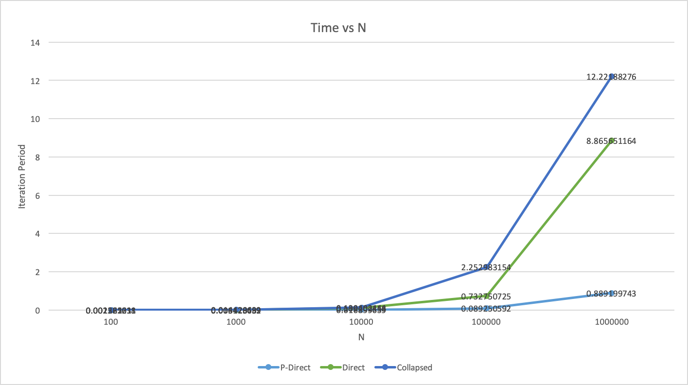
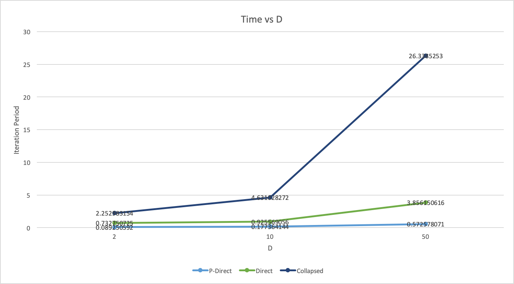
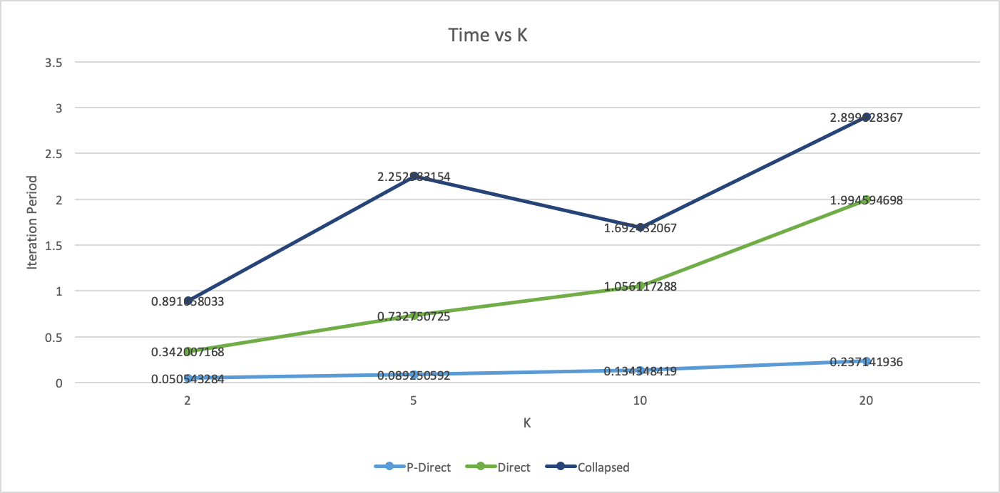
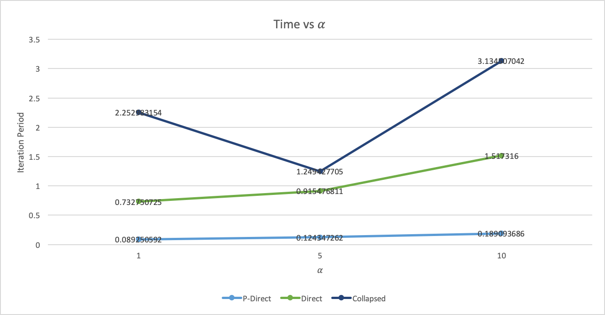

# DPMM.jl

This repository is a research work on parallel dirichlet process mixture models and clustering on Julia by Ekin Akyürek with supervision of John W. Fischer III.

## [Documentation](./docs/main.tex)

## Algorithms

1. Collapsed Gibbs Sampler
2. Quasi-Collapsed Gibbs Sampler
3. Direct Gibbs Sampler
4. Quasi-Direct Gibbs Sampler

## Parallel Algorithms

1. P-Quasi-Collapsed Gibbs Sampler
2. P-Direct Gibbs Sampler
3. P-Quasi-Direct Gibbs Sampler

## Benchmarks

### 1. Iteration Period

### 2. Convergence Analysis
